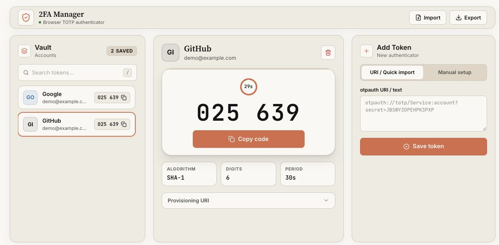

<div align="center">

# 2FA Manager

### A TOTP authenticator for your browser.

Generate two-factor authentication codes, find your accounts, and copy a code in one click. No sign-up required.

[Open the live app](https://2fa-manager.ridhoafwani.dev/) | [Get started](#get-started) | [Run locally](#run-locally) | [Contribute](CONTRIBUTING.md)

[](https://2fa-manager.ridhoafwani.dev/)
[](https://www.rfc-editor.org/rfc/rfc6238)
[](https://www.typescriptlang.org/)

[](https://2fa-manager.ridhoafwani.dev/)

<sub>Example accounts only. The preview contains no real credentials.</sub>

</div>

## What it does

2FA Manager is a browser-based TOTP authenticator and 2FA code generator. It uses the Web Crypto API to calculate time-based one-time passwords on your device and saves accounts in your browser's local storage.

- Add an account with a Base32 secret or an `otpauth://totp` URI.
- Copy a verification code and see when it expires.
- Search accounts by provider or account name. Press `/` or `Ctrl+K` on Windows and Linux, or `Cmd+K` on macOS.
- Configure SHA-1, SHA-256, or SHA-512, with 6, 7, or 8 digits and a custom refresh period.
- Export accounts to a JSON backup and import a backup from this app.
- Use the responsive layout on desktop or mobile.

## Get started

1. Open [2fa-manager.ridhoafwani.dev](https://2fa-manager.ridhoafwani.dev/).
2. Open the two-factor authentication settings of the service you want to protect.
3. Copy its setup secret into the manual entry form, or paste its `otpauth://totp` URI.
4. Add the token, then enter the generated code into that service to finish setup.
5. Keep the service's recovery codes somewhere safe.

Use the secret supplied by the service. Generating a random secret in this app does not connect it to an existing account.

## Storage and privacy

The app calculates codes locally and does not send token secrets to an application backend. The hosted page still makes network requests to load the app and Google Fonts.

**Saved secrets and exported JSON backups are not encrypted.** There is no master password or vault lock. Someone with access to your browser profile, or code running on the same origin, may be able to read them. Use a trusted device and protect your backup files.

Accounts belong to the current browser profile and site address. They do not sync between devices. Clearing site data removes saved accounts, so export a backup before clearing data or moving to another browser or deployment.

## Compatibility

| Capability | Support |
| --- | --- |
| Time-based codes | TOTP, defined in RFC 6238 |
| Hash algorithms | SHA-1, SHA-256, SHA-512 |
| Code length | 6, 7, or 8 digits |
| Setup input | Base32 secret or `otpauth://totp` URI |
| Backup import | JSON exports from 2FA Manager |
| Browser requirements | Web Crypto API, local storage, and HTTPS or localhost |

For services that support standard TOTP, use the manual setup secret they provide for authenticator apps such as Google Authenticator. This app does not scan QR codes or import Google Authenticator migration exports. It does not manage SMS codes, push approvals, or passkeys.

Code generation runs locally once the page has loaded. The app does not currently have a service worker, so reopening it without an internet connection is not guaranteed to work. If a service rejects a code, check your device's clock and the token settings.

## Run locally

Install Node.js 22.12 or newer and pnpm, then run:

```bash
git clone https://github.com/afwaniridho/2fa-manager.git
cd 2fa-manager
pnpm install --frozen-lockfile
pnpm dev
```

Open [localhost:3000](http://localhost:3000). No database or application API key is required for local development.

| Command | Purpose |
| --- | --- |
| `pnpm dev` | Start the development server |
| `pnpm build` | Build the app for production |
| `pnpm test` | Run the Vitest tests |
| `pnpm check` | Check formatting and lint rules with Biome |
| `pnpm deploy` | Build and deploy to Cloudflare Workers |

## Host your own instance

The project uses React 19, TypeScript, TanStack Start, Tailwind CSS 4, and the Cloudflare Vite plugin.

To deploy to your own Cloudflare account:

1. Install the dependencies and sign in with `pnpm exec wrangler login`.
2. Edit `wrangler.jsonc`. Set your Worker name and replace the custom domain with one you control, or remove `routes` to use a Workers subdomain.
3. Replace the public site URL in `src/routes/__root.tsx`, `public/robots.txt`, and `public/sitemap.xml` with your deployment URL.
4. Run `pnpm deploy`.

Use HTTPS for a hosted instance. Export accounts before moving between site addresses, because each address has separate browser storage.

## Contribute

Bug reports, documentation corrections, and focused pull requests are welcome. Read the [contribution guide](CONTRIBUTING.md) for setup and checks. Use dummy accounts in screenshots and reports, and never share a real 2FA secret or backup.

If you use 2FA Manager, a GitHub star helps other people find the project. Sharing a specific use case or a reproducible bug also helps improve it.
